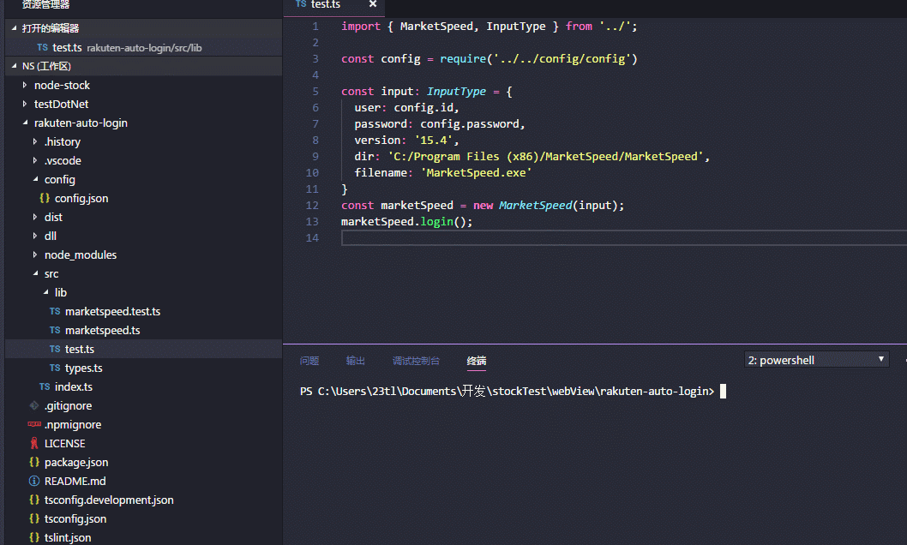

# rekuten-auto-login

楽天証券の MarketSpeed への自動ログインモジュール

## インストール

```js
npm install rakuten-auto-login --save
```

## 使い方

```js
import { MarketSpeed, InputType } from 'rakuten-auto-login';

const config = require('../../config/config');

const input: InputType = {
  user: config.id,
  password: config.password,
  version: '15.4',
  dir: 'C:/Program Files (x86)/MarketSpeed/MarketSpeed',
  filename: 'MarketSpeed.exe',
};
const marketSpeed = new MarketSpeed(input);
marketSpeed.login();
```

<p align="center"></p>
